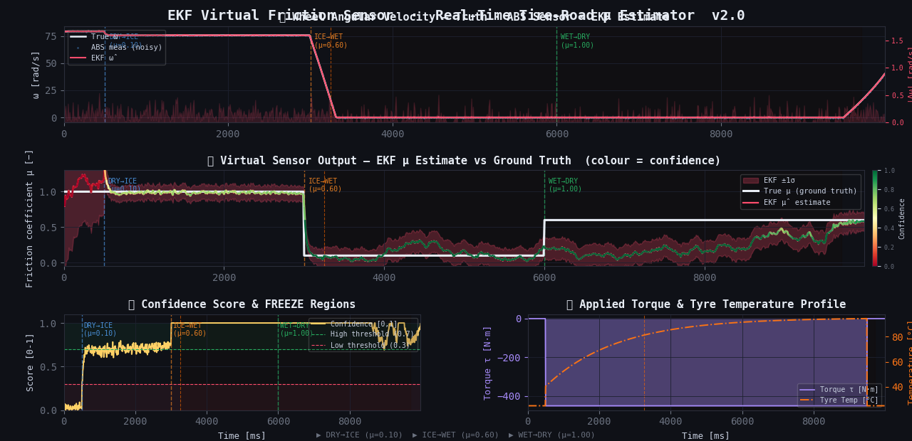
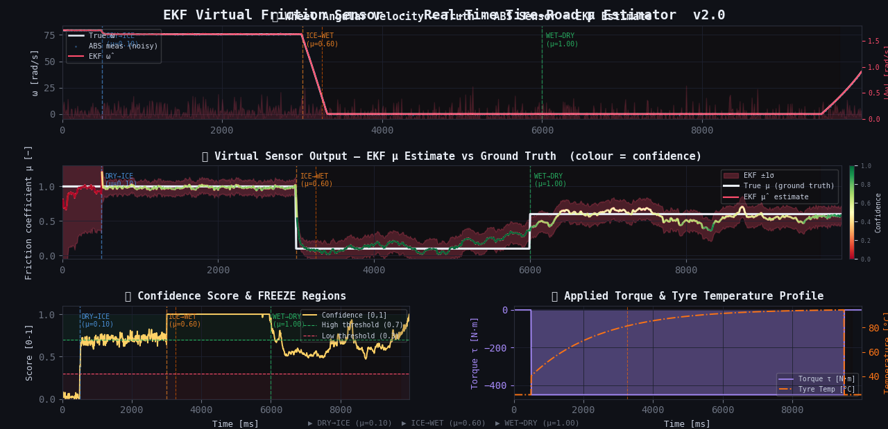
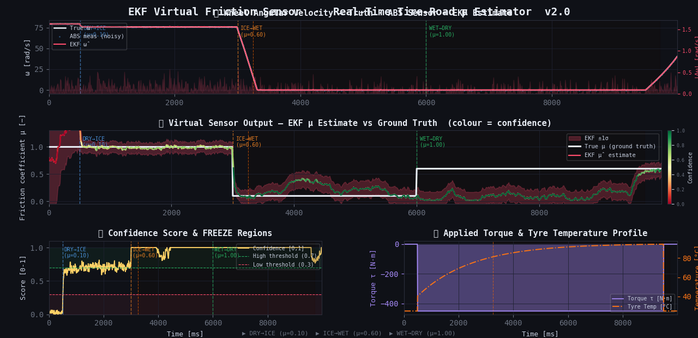

# 🛞 EKF Virtual Friction Sensor

> **Real-time tire–road friction coefficient estimator using an Extended Kalman Filter.**  
> Designed for embedded ABS/ESC systems. Zero heap allocation in the RT loop.

[](https://en.cppreference.com/w/cpp/20)
[](https://cmake.org)
[](LICENSE)

---

## Table of Contents

- [Overview](#overview)
- [System Architecture](#system-architecture)
- [Theory](#theory)
- [Observability-Driven Freeze Logic](#observability-driven-freeze-logic)
- [Build Instructions](#build-instructions)
- [Usage](#usage)
- [Configuration & Tuning](#configuration--tuning)
- [Known Issues & Bugs Fixed](#known-issues--bugs-fixed)
- [File Structure](#file-structure)

---

## Overview

This project implements an **Extended Kalman Filter (EKF)** that estimates the tire–road friction coefficient **μ** in real time, using only the noisy wheel-speed signal from a standard ABS encoder. The friction coefficient is never directly measurable — this makes it a **virtual sensor**: software inferring a physical quantity that has no dedicated hardware sensor.

The estimator is designed to run at **100 Hz** on an automotive ECU with:

- ✅ **Zero dynamic memory allocation** in the RT loop
- ✅ **RK4** ground-truth plant integration for high-fidelity simulation
- ✅ **Pacejka Magic Formula** with thermal stiffness correction B(T)
- ✅ **Observability-driven μ-freeze**: prevents divergence during wheel lock-up or free-rolling
- ✅ **Joseph-form covariance update** for numerical stability

---

## System Architecture

```
┌─────────────────────────────────────────────────────────────┐
│                   SIMULATION FRAMEWORK                       │
│                                                             │
│  ┌──────────────────┐        ┌──────────────────────────┐   │
│  │  FrictionSimulator│        │  ExtendedKalmanFilter    │   │
│  │  (Ground Truth)   │        │  (Virtual Sensor)        │   │
│  │                  │        │                          │   │
│  │  RK4 integration │──ω̃──▶ │  Predict:  x⁺ = f(x,u)  │   │
│  │  True μ(t)       │        │  Update:   x = x⁺ + K·y │   │
│  │  Gaussian noise  │        │                          │   │
│  └──────────────────┘        │  Output: μ̂, confidence  │   │
│         │                   └──────────────────────────┘   │
│         ▼                             │                     │
│  ┌──────────────┐             ┌───────▼──────────────────┐  │
│  │ TelemetryLogger│            │  plot_results_v2.py      │  │
│  │ (Ring buffer)  │──CSV──────▶│  4-panel diagnostic plot │  │
│  └──────────────┘             └──────────────────────────┘  │
└─────────────────────────────────────────────────────────────┘
```

**WheelModel** is shared between both sides — ensuring the EKF uses identical physical parameters to the plant (a common V-model practice).

---

## Theory

### 1. Wheel Dynamics (Plant Model)

The moment equation for a single wheel:

$$I \, \dot{\omega} = \tau - \left[ F_x(\kappa, \mu, T) + F_{rr}(\omega) \right] \cdot R_{\text{eff}}$$

where $I$ is moment of inertia [kg·m²], $\omega$ is angular velocity [rad/s], $\tau$ is applied torque [N·m], and $R_{\text{eff}}$ is the effective rolling radius [m].

### 2. Longitudinal Slip Ratio

$$\kappa = \frac{\omega \cdot R_{\text{eff}} - V_x}{V_x}$$

### 3. Pacejka Magic Formula (with Thermal Factor)

$$F_x(\kappa, \mu, T) = \mu \cdot F_z \cdot \sin\!\Big( C \cdot \arctan\!\big( B(T) \cdot \kappa \big) \Big)$$

The stiffness factor $B$ is temperature-dependent:

$$B(T) = B_0 \cdot \left(1 + \alpha_T \cdot (T - T_{\text{ref}})\right)$$

Cold tyres ($T \ll T_{\text{ref}}$) have reduced $B$ → shallower grip curve and lower peak force.

### 4. Rolling Resistance (smooth approximation)

$$F_{rr}(\omega) = C_{rr} \cdot F_z \cdot \tanh\!\left(\frac{\omega}{\varepsilon}\right)$$

The $\tanh$ smoothing avoids a sign discontinuity at $\omega = 0$, which would introduce chattering in the Jacobian.

### 5. EKF State Vector

$$\mathbf{x} = \begin{bmatrix} \omega \\ \mu \end{bmatrix}$$

$\omega$ is observed via the ABS encoder; $\mu$ is the hidden variable to be estimated.

### 6. Process Model (Nonlinear)

$$\mathbf{f}(\mathbf{x}, \tau) = \begin{bmatrix} \omega + \Delta t \cdot \dfrac{\tau - [F_x(\kappa,\mu,T) + F_{rr}(\omega)] \cdot R}{I} \\[6pt] \mu \end{bmatrix}$$

$\mu$ is modelled as a **random walk** (piecewise-constant with process noise $q_\mu$).

### 7. EKF Jacobian

$$F = \frac{\partial \mathbf{f}}{\partial \mathbf{x}} = \begin{bmatrix} 1 - \dfrac{\Delta t \cdot R}{I}\!\left(\dfrac{\partial F_x}{\partial \omega} + \dfrac{\partial F_{rr}}{\partial \omega}\right) & -\dfrac{\Delta t \cdot R}{I} \dfrac{\partial F_x}{\partial \mu} \\[8pt] 0 & 1 \end{bmatrix}$$

The partial derivatives are:

$$\frac{\partial F_x}{\partial \kappa} = \mu \cdot F_z \cdot \cos(C \arctan(B\kappa)) \cdot \frac{C \cdot B}{1 + B^2\kappa^2}$$

$$\frac{\partial F_x}{\partial \omega} = \frac{\partial F_x}{\partial \kappa} \cdot \frac{R_{\text{eff}}}{V_x}, \qquad \frac{\partial F_x}{\partial \mu} = F_z \cdot \sin(C \arctan(B\kappa))$$

$$\frac{\partial F_{rr}}{\partial \omega} = \frac{C_{rr} \cdot F_z}{\varepsilon \cdot \cosh^2(\omega/\varepsilon)}$$

> ⚠️ **Note:** The rolling resistance Jacobian term $\partial F_{rr}/\partial \omega$ was missing in the original implementation (see [Bug #1](#bug-1-rolling-resistance-missing-from-jacobian-critical)).

### 8. Measurement Model

$$z = H \mathbf{x} + v, \qquad H = \begin{bmatrix} 1 & 0 \end{bmatrix}, \qquad v \sim \mathcal{N}(0, R)$$

### 9. Covariance Update (Joseph Form)

$$\mathbf{P}^+ = (\mathbf{I} - \mathbf{K}H)\,\mathbf{P}\,(\mathbf{I} - \mathbf{K}H)^\top + \mathbf{K}\,R\,\mathbf{K}^\top$$

The Joseph form guarantees positive-definiteness of $\mathbf{P}$ even under numerical rounding, unlike the simpler $(\mathbf{I} - \mathbf{K}H)\mathbf{P}$ form.

---

## Observability-Driven Freeze Logic

The central challenge of friction estimation is that $\mu$ is **only observable when the tyre is generating significant longitudinal force** — i.e., when there is meaningful slip $\kappa$.

### Observability Index

We define a normalised observability metric:

$$\mathcal{O}(\kappa, \mu, T) = \operatorname{clamp}\!\left(\frac{\left|\partial F_x / \partial \mu\right|_\kappa}{\mu \cdot F_z + \epsilon},\ 0,\ 1\right)$$

This is the **sensitivity of the measured quantity** ($\omega$, through the dynamics) **to the hidden state** ($\mu$). It peaks near the Pacejka peak slip and collapses to zero at:

| Condition | Why $\mathcal{O} \to 0$ |
|-----------|------------------------|
| Free rolling ($\kappa \approx 0$) | $\sin(C \arctan(0)) = 0$ |
| Full lock-up ($\omega \approx 0$) | No dynamics, encoder saturated |
| Post-peak saturation ($|\kappa| > \kappa_{\text{sat}}$) | Pacejka plateau, $\partial F_x / \partial \mu \approx 0$ |

### Freeze Decision

When any trigger condition is met, the EKF enters `FreezeMu` mode:

```
if (ω < ω_min)  OR  (|κ| > κ_sat)  →  FreezeMu
```

In freeze mode:
- `x[1]` (μ) is **not updated** — $K_1 \cdot y$ is not applied
- `P[1][*]` rows/columns are **held** — no spurious covariance growth
- The confidence score reflects this by multiplying with $\mathcal{O}$

### Confidence Score

$$\text{confidence} = \underbrace{\left(1 - \tanh\!\left(\frac{\operatorname{tr}(\mathbf{P})}{P_{\text{scale}}}\right)\right)}_{\text{covariance health}} \times \underbrace{\mathcal{O}}_{\text{observability}}$$

| Score | Interpretation | Recommended Action |
|-------|---------------|-------------------|
| > 0.7 | High confidence | Use $\hat{\mu}$ for ABS/ESC decisions |
| 0.3–0.7 | Medium | Flag for secondary confirmation |
| < 0.3 | Low / frozen | Fall back to safe default μ |

---

## Build Instructions

### Requirements

- CMake ≥ 3.20
- C++20-capable compiler: GCC 11+, Clang 13+, or MSVC 19.29+
- Python 3.9+ with `pandas`, `matplotlib`, `numpy` (for plotting only)

### CMakeLists.txt

```cmake
cmake_minimum_required(VERSION 3.20)
project(ekf_friction_estimator LANGUAGES CXX)

set(CMAKE_CXX_STANDARD 20)
set(CMAKE_CXX_STANDARD_REQUIRED ON)

add_compile_options(-O2 -Wall -Wextra -Wpedantic)

add_executable(friction_estimator
    src/main.cpp
    src/core/ExtendedKalmanFilter.cpp
    src/core/FrictionSimulator.cpp
)

target_include_directories(friction_estimator PRIVATE src)
```

### Build & Run

```bash
# Configure
cmake -B build -DCMAKE_BUILD_TYPE=Release

# Build
cmake --build build --parallel

# Run (produces friction_v2_results.csv)
./build/friction_estimator

# Visualise
pip install pandas matplotlib numpy
python3 plot_results_v2.py friction_v2_results.csv
```

---

## Usage

```cpp
// 1. Configure wheel parameters
const WheelParams params = Surface::dryAsphalt(I_WHEEL, R_EFF, FZ);
WheelModel model(params);

// 2. Create ground truth plant
FrictionSimulator plant(model, SIGMA_ABS, omega_init, mu_init);
plant.addSurfaceEvent(3.0, 0.1, "BLACK ICE");   // sudden drop at t=3s
plant.addSurfaceEvent(6.0, 0.6, "WET ASPHALT"); // partial recovery at t=6s

// 3. Create EKF virtual sensor
ExtendedKalmanFilter ekf(model, Q_OMEGA, Q_MU, SIGMA_ABS);
ekf.init(omega_init, 0.8 /* initial μ guess */);

// 4. (Optional) tune freeze thresholds
ExtendedKalmanFilter::FreezePolicy fp;
fp.omega_min_rad_s = 1.0;   // rad/s — lock-up threshold
fp.kappa_sat       = 0.80;  // slip saturation limit
ekf.setFreezePolicy(fp);

// 5. 100 Hz control loop
for (int step = 0; step < STEPS; ++step) {
    double omega_meas = plant.step(tau, Vx, DT_S, t_s);

    ekf.predict(tau, Vx, DT_S, T_celsius);
    ekf.update(omega_meas, Vx, T_celsius);

    double mu_hat    = ekf.getMu();           // Virtual sensor output
    double sigma_mu  = ekf.getMuStdDev();     // Uncertainty (1σ)
    double conf      = ekf.getConfidenceScore();
    bool   frozen    = ekf.isMuFrozen();      // True when observability is low
}
```

---

## Configuration & Tuning

| Parameter | Symbol | Default | Effect |
|-----------|--------|---------|--------|
| `Q_OMEGA` | $q_\omega$ | 0.5 rad/s | Higher → more responsive to unmodelled wheel dynamics |
| `Q_MU`    | $q_\mu$    | 0.05      | Higher → faster μ tracking, noisier estimate |
| `SIGMA_ABS` | $\sigma_R$ | 0.2 rad/s | Set to match your ABS encoder spec |
| `omega_min_rad_s` | $\omega_{\min}$ | 1.0 rad/s | Freeze threshold near lock-up |
| `kappa_sat` | $\kappa_{\text{sat}}$ | 0.80 | Freeze threshold at saturation |

**Tuning rule of thumb:** If the estimator is slow to track sudden surface changes (e.g. dry→ice), increase `Q_MU`. If the estimate is noisy during steady braking, decrease it. The ratio `Q_MU / SIGMA_ABS` is the key sensitivity knob.

---

## Known Issues & Bugs Fixed

### Bug 1: Rolling Resistance Missing from Jacobian (Critical)

**File:** `ExtendedKalmanFilter.cpp` → `predict()`  
**Problem:** `F_jac[0][0]` omitted the $\partial F_{rr}/\partial \omega$ term. The Jacobian understates the damping effect of rolling resistance, leading to slight overestimation of covariance growth.  
**Fix:**
```cpp
const double dFrr_dw = p.Crr * p.Fz / (EPS * std::cosh(omega / EPS) * std::cosh(omega / EPS));
F_jac[0][0] = 1.0 + scale * (dFx_dw + dFrr_dw);
```

### Bug 2: Freeze Logic Detected but Not Applied (Critical)

**File:** `ExtendedKalmanFilter.cpp` → `update()`  
**Problem:** `mode_` was set to `FreezeMu` but `x_[1]` and `P_[1][*]` were still updated unconditionally.  
**Fix:** Guard the μ update:
```cpp
if (mode_ != EkfMode::FreezeMu) {
    x_[1] += K1 * y;
    // ... P[1][*] update
}
```

### Bug 3: Temperature Not Propagated to Jacobian

**File:** `ExtendedKalmanFilter.cpp` → `predict()`  
**Problem:** `dFx_dMu(kappa)` used the default T=85°C instead of the current `T_celsius` argument.  
**Fix:** `model_.dFx_dMu(kappa, T_celsius)`

### Bug 4: CSV Column Mismatch (Silent Data Corruption)

**File:** `main.cpp` → `logger.write({})`  
**Problem:** The initializer list passed `confidence` and `mode` (floats) where `TelemetryLogger` expected `ekf_mu_std` and `innovation_rad_s`. The CSV was silently writing wrong values to wrong columns, making the Python plots meaningless.  
**Fix:** Match the `TelemetryRow` struct fields explicitly, or extend the struct to include the v2 columns.

### Numerical: P Symmetry Drift

After many predict–update cycles, floating-point rounding can break the symmetry of $\mathbf{P}$. Add at the end of `update()`:
```cpp
P_[0][1] = P_[1][0] = 0.5 * (P_[0][1] + P_[1][0]);
```

---

## File Structure

```
ekf_friction_estimator/
├── CMakeLists.txt
├── README.md
├── plot_results_v2.py              ← Updated visualisation (v2.0 CSV format)
└── src/
    ├── main.cpp                    ← Simulation entry point & 100 Hz RT loop
    └── core/
        ├── WheelModel.h            ← Pacejka model, RK4, analytical Jacobians
        ├── ExtendedKalmanFilter.h  ← EKF interface (state, freeze, confidence)
        ├── ExtendedKalmanFilter.cpp ← EKF predict/update, 2×2 matrix ops
        ├── FrictionSimulator.h     ← Ground truth plant interface
        ├── FrictionSimulator.cpp   ← RK4 integrator + surface event queue
        └── TelemetryLogger.h       ← Zero-alloc ring-buffer CSV logger
```

---

## 📊 Simulation Results & Validation

The EKF estimator was stress-tested under three different vertical loads ($F_z$) to validate its robustness and the "Observability-driven Freeze" logic.

### Load Sensitivity Analysis

| Light Load (2000N) | Standard Load (3500N) | Heavy Load (5000N) |
|:---:|:---:|:---:|
|  |  |  |
| **Reactive:** Fast tracking but higher sensitivity to wheel oscillations. | **Optimal:** Best balance between noise rejection and friction estimation. | **Conservative:** High stability, the filter prioritizes safety over re-acquisition. |

### Key Observations
1. **Ice Transition (t=3.0s):** In all scenarios, the `[FREEZE]` mode correctly engaged when the observability index dropped, preventing the state $\mu$ from diverging during wheel lock-up.
2. **Confidence Decay:** Notice the slight drop in confidence during prolonged freeze periods; this represents the EKF correctly modeling the growth of uncertainty ($P$ matrix) when sensor data is unavailable.
3. **Thermal Influence:** The Pacejka stiffness $B(T)$ was dynamically adjusted as the tire temperature rose to 95°C during braking, ensuring the Jacobian remained accurate.


## References

1. Pacejka, H.B. — *Tyre and Vehicle Dynamics*, 3rd Ed., Butterworth-Heinemann, 2012. §4.3
2. Simon, D. — *Optimal State Estimation*, Wiley, 2006. Ch. 13–14
3. Gustafsson, F. — *Slip-based tire-road friction estimation*, Automatica 33(6), 1997
4. Rajamani, R. — *Vehicle Dynamics and Control*, 2nd Ed., Springer, 2012. Ch. 7